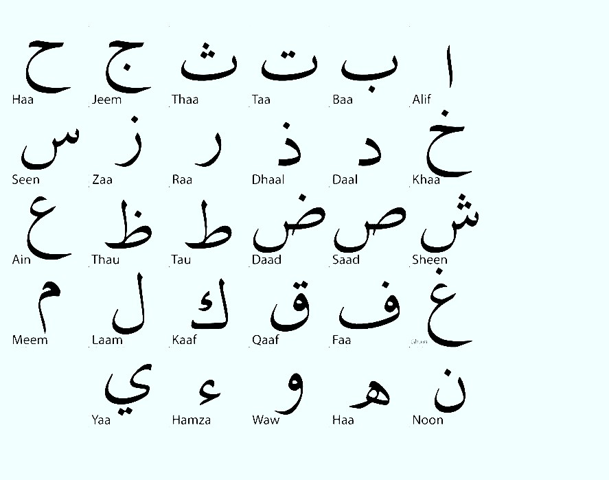
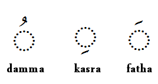
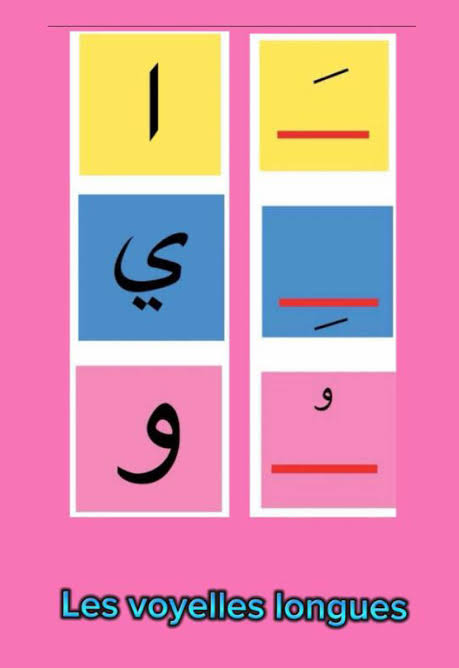

[//]: #(home)
[home]: ../../../README.md

[//]: #(doc)
[doc platform whatis]: ../whatis/doc.ptf.md
[language whatis]: concept/language/whatis/ep.md
[ipa whatis]:      /concept/language/whatis/ipa.md

[↖][home]


<h1 align="center">Arabic Language</h1>


# Aphabet


The Arabic [language][language whatis] is made of 28 letters. [IPA][ipa whatis] is used for the sound

|  | Letter | Name | IPA   | English IPA | French IPA | Approximate sound
| -: | :-:| :----: |:-----:| ----------  | --------   | :---- |
|  1 | ا  | Alif   |  /aː/ | /ˈælɪf/     | /a.lif/    | long **a**
|  2 | ب  | Bāʾ    |   /b/ | /baː/       | /baː/      | B
|  3 | ت  | Tāʾ    |   /t/ | /taː/       | /taː/      | T
|  4 | ث  | Thāʾ   |   /θ/ | /θɑː/       | /θaː/      | **th** as in **th**ink
|  5 | ج  | Jīm    |  /d͡ʒ/ | /dʒiːm/     | /dʒiːm/    | **dj** as in **j**ob
|  6 | ح  | Ḥāʾ    |   /ħ/ | /ħaː/       | /aː/       | deep/emphatic **h** as in **Hamid**, **Hem** (meat)
|  7 | خ  | Khāʾ   |   /x/ | /xaː/       | /xaː/      | **kh** as in **Khalid** or **Khal** (vinaigre) 
|  8 | د  | Dāl    |   /d/ | /daːl/      | /daːl/     | D
|  9 | ذ  | Dhāl   |   /ð/ | /ðaːl/      | /ðaːl/     | **th** as in **this**
| 10 | ر  | Rāʾ    |   /r/ | /raː/       | /ɛʁ/       | R as **r** in spanish **restaurabnte**
| 11 | ز  | Zāy    |   /z/ | /zeɪ/       | /zɛ/       | Z
| 12 | س  | Sīn    |   /s/ | /siːn/      | /siːn/     | S
| 13 | ش  | Shīn   |   /ʃ/ | /ʃiːn/      | /ʃiːn/     | **sh** as in **ship**
| 14 | ص  | Ṣād    |  /sˤ/ | /sˤaːd/     | /saːd/     | emphatic **s**
| 15 | ض  | Ḍād    |  /dˤ/ | /dˤaːd/     | /daːd/     | emphatic **d**
| 16 | ط  | Ṭāʾ    |  /tˤ/ | /tˤaː/      | /taː/      | emphatic **t**
| 17 | ظ  | Ẓāʾ    |  /ðˤ/ | /ðˤaː/      | /zaː/      | emphatic **th**
| 18 | ع  | ʿAyn   |   /ʕ/ | /ʕaɪn/      | /ʕajn/     | **3** as in **3ayn** (eye)
| 19 | غ  | Ghayn  |   /ɣ/ | /ɣaɪn/      | /ɣajn/     | **gh** as in Ma**gh**reb (moroco)
| 20 | ف  | Fāʾ    |   /f/ | /faː/       | /faː/      | F
| 21 | ق  | Qāf    |   /q/ | /kaːf/      | /kaːf/     | deep/back **k** 
| 22 | ك  | Kāf    |   /k/ | /kaːf/      | /kaːf/     | K
| 23 | ل  | Lām    |   /l/ | /laːm/      | /laːm/     | L
| 24 | م  | Mīm    |   /m/ | /miːm/      | /miːm/     | M
| 25 | ن  | Nūn    |   /n/ | /nuːn/      | /nuːn/     | N
| 26 | ه  | Hāʾ    |   /h/ | /haː/       | /aʃ/       | H
| 27 | و  | Wāw    |   /w/ | /waːw/      | /waːw/     | W
| 28 | ي  | Yāʾ    |   /j/ | /jaː/       | /jaː/      | **y** as in **yes**


## Alphabet in image


## regrouped Alphabet

- In Arabic Alphabet many letters shares the same **shape**
- Rule 01: `A letter is written differently depending on whether it is at the beginning, in the middle, or at the end of a word.`

|    | Letter 1 | Letter 2 | Letter 3 | Name             | Begin | Middle | End | 
| -: | :------: | :------: | :------: | :--------------- | :---: | :----: | :-: |
|  1 |     ا    |          |          | Alif             |   ا   |   ـا   |  ـا |
|  2 |     ب    |     ت    |     ث    | Bāʾ / Tāʾ / Thāʾ |   بـ  |   ـبـ  |  ـب |
|  3 |     ج    |     ح    |     خ    | Jīm / Ḥāʾ / Khāʾ |   جـ  |   ـجـ  |  ـج |
|  4 |     د    |     ذ    |          | Dāl / Dhāl       |   د   |   ـد   |  ـد |
|  5 |     ر    |     ز    |          | Rāʾ / Zāy        |   ر   |   ـر   |  ـر |
|  6 |     س    |     ش    |          | Sīn / Shīn       |   سـ  |   ـسـ  |  ـس |
|  7 |     ص    |     ض    |          | Ṣād / Ḍād        |   صـ  |   ـصـ  |  ـص |
|  8 |     ط    |     ظ    |          | Ṭāʾ / Ẓāʾ        |   طـ  |   ـطـ  |  ـط |
|  9 |     ع    |     غ    |          | ʿAyn / Ghayn     |   عـ  |   ـعـ  |  ـع |
| 10 |     ف    |          |          | Fāʾ              |   فـ  |   ـفـ  |  ـف |
| 11 |     ق    |          |          | Qāf              |   قـ  |   ـقـ  |  ـق |
| 12 |     ك    |          |          | Kāf              |   كـ  |   ـكـ  |  ـك |
| 13 |     ل    |          |          | Lām              |   لـ  |   ـلـ  |  ـل |
| 14 |     م    |          |          | Mīm              |   مـ  |   ـمـ  |  ـم |
| 15 |     ن    |          |          | Nūn              |   نـ  |   ـنـ  |  ـن |
| 16 |     ه    |          |          | Hāʾ              |   هـ  |   ـهـ  |  ـه |
| 17 |     و    |          |          | Wāw              |   و   |   ـو   |  ـو |
| 18 |     ي    |          |          | Yāʾ              |   يـ  |   ـيـ  |  ـي |

# Building sound
- like other [languages][language whatis] Arabic uses its own rules and signs to represent and build sounds in written words.
- Rule 02: `Some letters do not connect`


## Short vowels

| Name   | IPA  | Short-vowel letter |
| ------ | ---- | ------------------ |
| Fatḥah | /aː/ | **ا**              |
| Kasrah | /iː/ | **ي**              |
| Ḍammah | /uː/ | **و**              |

| Name | ipa |
| - | - |
| Fatha  | /a/ | X | 
| Kasrah | /i/ | X |
| Ḍammah | /u/ | X |

**Image**: 
```
◌ُ  ◌ِ  ◌َ

```
**Image**: 



**Example**: 

| Name | Letter|  /a/   | /i/    | /u/    |
| ---- | ----- |------- | ------ | ------ |
| Bāʾ | ب | بَ  | بِ   | بُ  |
| Dāl | د  | دَ  | دِ  | دُ  |
| Lām | ل  | لَ  | لِ  | لُ  |


## Long vowels

| Name   | IPA  | Long-vowel letter |
| ------ | ---- | ----------------- |
| Fatḥah | /aː/ | **ا**             |
| Kasrah | /iː/ | **ي**             |
| Ḍammah | /uː/ | **و**             |

**Image**: 



**Example**: 

| Name    | Letter | /aː/    | /iː/    | /uː/    |
| ------- | ------ | ------- | ------- | ------- |
| Bāʾ | ب      | بَا | بِي | بُو |
| Dāl | د      | دَا | دِي | دُو |
| Lām | ل      | لَا | لِي | لُو |

## Soukoune

## Tanwine


# Spelling rules
As any languages, Arabic language have rules to write words.

## 

# Todo
**singular**
```
حرف = ḥarf = letter
```
**Plural**
```
حروف (ḥurūf) = letters
```
