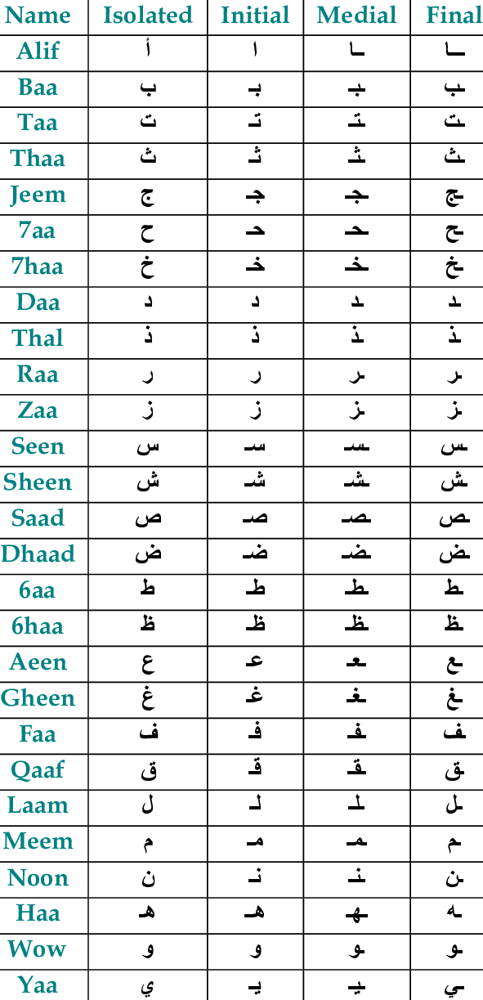
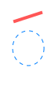
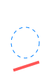
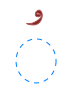
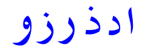
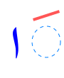
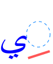
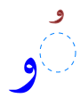
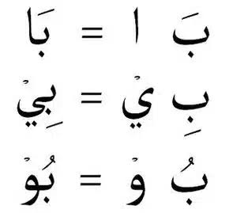
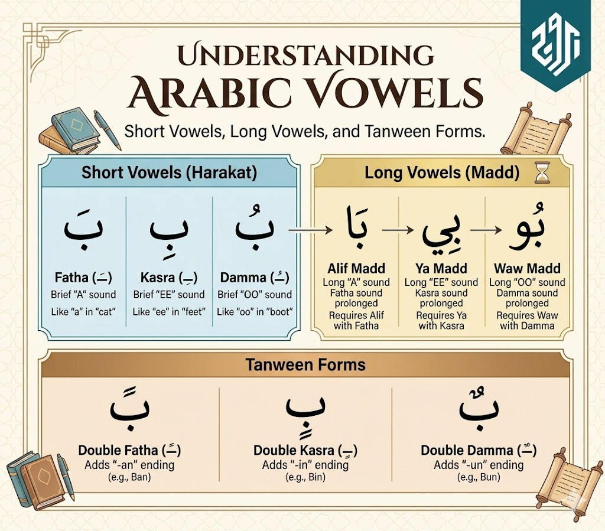

[//]: #(home)
[home]: ../../../README.md

[//]: #(doc)
[doc platform whatis]: ../whatis/doc.ptf.md
[language whatis]: /concept/language/whatis/ep.md
[ipa whatis]:      /concept/language/whatis/ipa.md
[arabic 01 whatis]: https://burujacademy.com/blog/vowels-in-arabic/
[arabic Alphabet svg whatis]:https://commons.wikimedia.org/wiki/Category:Arabic_glyphs_in_SVG

[↖][home]

Related topics

| Topic | Location | Kind |
|-|-|-|
|[learn arabic][arabic 01 whatis]|external|
|[arabic alphabet svg][arabic Alphabet svg whatis]|external|

<h1 align="center">Arabic Language</h1>


# Aphabet


The Arabic [language][language whatis] is made of 28 letters. [IPA][ipa whatis] is used for the sound

|  | Letter | Name | Sound | English IPA | French IPA | Approximate sound
| -: | :-:| :----: |:-----:| ----------  | --------   | :---- |
|  1 | ا  | Alif   |  /aː/ | /ˈælɪf/     | /a.lif/    | long **a**
|  2 | ب  | Bāʾ    |   /b/ | /baː/       | /baː/      | B
|  3 | ت  | Tāʾ    |   /t/ | /taː/       | /taː/      | T
|  4 | ث  | Thāʾ   |   /θ/ | /θɑː/       | /θaː/      | **th** as in **th**ink
|  5 | ج  | Jīm    |  /d͡ʒ/ | /dʒiːm/     | /dʒiːm/    | **dj** as in **j**ob
|  6 | ح  | Ḥāʾ    |   /ħ/ | /ħaː/       | /aː/       | deep/emphatic **h** as in **Hamid**, **Hem** (meat)
|  7 | خ  | Khāʾ   |   /x/ | /xaː/       | /xaː/      | **kh** as in **Khalid** or **Khal** (vinaigre) 
|  8 | د  | Dāl    |   /d/ | /daːl/      | /daːl/     | D
|  9 | ذ  | Dhāl   |   /ð/ | /ðaːl/      | /ðaːl/     | **th** as in **this**
| 10 | ر  | Rāʾ    |   /r/ | /raː/       | /ɛʁ/       | R as **r** in spanish **restaurabnte**
| 11 | ز  | Zāy    |   /z/ | /zeɪ/       | /zɛ/       | Z
| 12 | س  | Sīn    |   /s/ | /siːn/      | /siːn/     | S
| 13 | ش  | Shīn   |   /ʃ/ | /ʃiːn/      | /ʃiːn/     | **sh** as in **sh**ip
| 14 | ص  | Ṣād    |  /sˤ/ | /sˤaːd/     | /saːd/     | emphatic **s**
| 15 | ض  | Ḍād    |  /dˤ/ | /dˤaːd/     | /daːd/     | emphatic **d**
| 16 | ط  | Ṭāʾ    |  /tˤ/ | /tˤaː/      | /taː/      | emphatic **t**
| 17 | ظ  | Ẓāʾ    |  /ðˤ/ | /ðˤaː/      | /zaː/      | emphatic **th**
| 18 | ع  | ʿAyn   |   /ʕ/ | /ʕaɪn/      | /ʕajn/     | **3** as in **3ayn** (eye)
| 19 | غ  | Ghayn  |   /ɣ/ | /ɣaɪn/      | /ɣajn/     | **gh** as in Ma**gh**reb (moroco)
| 20 | ف  | Fāʾ    |   /f/ | /faː/       | /faː/      | F
| 21 | ق  | Qāf    |   /q/ | /kaːf/      | /kaːf/     | deep/back **k** 
| 22 | ك  | Kāf    |   /k/ | /kaːf/      | /kaːf/     | K
| 23 | ل  | Lām    |   /l/ | /laːm/      | /laːm/     | L
| 24 | م  | Mīm    |   /m/ | /miːm/      | /miːm/     | M
| 25 | ن  | Nūn    |   /n/ | /nuːn/      | /nuːn/     | N
| 26 | ه  | Hāʾ    |   /h/ | /haː/       | /aʃ/       | H
| 27 | و  | Wāw    |   /w/ | /waːw/      | /waːw/     | W
| 28 | ي  | Yāʾ    |   /j/ | /jaː/       | /jaː/      | **y** as in **yes**


## Alphabet in image
The arabic language may be written using different font chars, as in this alphabet of Isolated letters.


## Arabic Alphabet by Letter Shapes

- In Arabic Alphabet many letters shares the same **shape**
- Rule 01: `A letter is written differently depending on whether it is at the beginning, in the middle, or at the end of a word.`


|    |          | isolated |          | Name             | End | Middle | Begin |
| -: | :------: | :------: | :------: | :--------------- | :-: | :----: | :---: |
|  1 |     ا    |          |          | Alif             |  ـا |   ـا   |   ا   |
|  2 |     ب    |     ت    |     ث    | Bāʾ / Tāʾ / Thāʾ |  ـب |   ـبـ  |   بـ  |
|  3 |     ج    |     ح    |     خ    | Jīm / Ḥāʾ / Khāʾ |  ـج |   ـجـ  |   جـ  |
|  4 |     د    |     ذ    |          | Dāl / Dhāl       |  ـد |   ـد   |   د   |
|  5 |     ر    |     ز    |          | Rāʾ / Zāy        |  ـر |   ـر   |   ر   |
|  6 |     س    |     ش    |          | Sīn / Shīn       |  ـس |   ـسـ  |   سـ  |
|  7 |     ص    |     ض    |          | Ṣād / Ḍād        |  ـص |   ـصـ  |   صـ  |
|  8 |     ط    |     ظ    |          | Ṭāʾ / Ẓāʾ        |  ـط |   ـطـ  |   طـ  |
|  9 |     ع    |     غ    |          | ʿAyn / Ghayn     |  ـع |   ـعـ  |   عـ  |
| 10 |     ف    |          |          | Fāʾ              |  ـف |   ـفـ  |   فـ  |
| 11 |     ق    |          |          | Qāf              |  ـق |   ـقـ  |   قـ  |
| 12 |     ك    |          |          | Kāf              |  ـك |   ـكـ  |   كـ  |
| 13 |     ل    |          |          | Lām              |  ـل |   ـلـ  |   لـ  |
| 14 |     م    |          |          | Mīm              |  ـم |   ـمـ  |   مـ  |
| 15 |     ن    |          |          | Nūn              |  ـن |   ـنـ  |   نـ  |
| 16 |     ه    |          |          | Hāʾ              |  ـه |   ـهـ  |   هـ  |
| 17 |     و    |          |          | Wāw              |  ـو |   ـو   |   و   |
| 18 |     ي    |          |          | Yāʾ              |  ـي |   ـيـ  |   يـ  |


## Arabic Alphabet by position





## Arabic Alphabet by Similar Sounds
- This section groups letters that may sound similar to non-Arabic speakers.

- To help distinguish between them, several example words are provided for each letter.


|  | Letter | Name | Sound | English IPA | French IPA | Approximate sound
| -: | :-:| :----: |:-----:| ----------  | --------   | :---- |
|  1 | ا  | Alif   |  /aː/ | /ˈælɪf/     | /a.lif/    | long **a**
| 26 | ه  | Hāʾ    |   /h/ | /haː/       | /aʃ/       | H
||
|  2 | ب  | Bāʾ    |   /b/ | /baː/       | /baː/      | B
||
|  3 | ت  | Tāʾ    |   /t/ | /taː/       | /taː/      | T
| 16 | ط  | Ṭāʾ    |  /tˤ/ | /tˤaː/      | /taː/      | emphatic **t**
||
|  4 | ث  | Thāʾ   |   /θ/ | /θɑː/       | /θaː/      | **th** as in **th**ink
| 12 | س  | Sīn    |   /s/ | /siːn/      | /siːn/     | S
| 14 | ص  | Ṣād    |  /sˤ/ | /sˤaːd/     | /saːd/     | emphatic **s**
||
|  5 | ج  | Jīm    |  /d͡ʒ/ | /dʒiːm/     | /dʒiːm/    | **dj** as in **j**ob
||
|  6 | ح  | Ḥāʾ    |   /ħ/ | /ħaː/       | /aː/       | deep/emphatic **h** as in **Hamid**, **Hem** (meat)
|  7 | خ  | Khāʾ   |   /x/ | /xaː/       | /xaː/      | **kh** as in **Khalid** or **Khal** (vinaigre) 
||
|  8 | د  | Dāl    |   /d/ | /daːl/      | /daːl/     | D
| 15 | ض  | Ḍād    |  /dˤ/ | /dˤaːd/     | /daːd/     | emphatic **d**
||
|  9 | ذ  | Dhāl   |   /ð/ | /ðaːl/      | /ðaːl/     | **th** as in **this**
| 11 | ز  | Zāy    |   /z/ | /zeɪ/       | /zɛ/       | Z
| 17 | ظ  | Ẓāʾ    |  /ðˤ/ | /ðˤaː/      | /zaː/      | emphatic **th**
||
| 10 | ر  | Rāʾ    |   /r/ | /raː/       | /ɛʁ/       | R as **r** in spanish **restaurabnte**
| 13 | ش  | Shīn   |   /ʃ/ | /ʃiːn/      | /ʃiːn/     | **sh** as in **sh**ip
||
| 18 | ع  | ʿAyn   |   /ʕ/ | /ʕaɪn/      | /ʕajn/     | **3** as in **3ayn** (eye)
| 19 | غ  | Ghayn  |   /ɣ/ | /ɣaɪn/      | /ɣajn/     | **gh** as in Ma**gh**reb (moroco)
||
| 20 | ف  | Fāʾ    |   /f/ | /faː/       | /faː/      | F
||
| 21 | ق  | Qāf    |   /q/ | /kaːf/      | /kaːf/     | deep/back **k** 
| 22 | ك  | Kāf    |   /k/ | /kaːf/      | /kaːf/     | K
||
| 23 | ل  | Lām    |   /l/ | /laːm/      | /laːm/     | L
| 24 | م  | Mīm    |   /m/ | /miːm/      | /miːm/     | M
| 25 | ن  | Nūn    |   /n/ | /nuːn/      | /nuːn/     | N
| 27 | و  | Wāw    |   /w/ | /waːw/      | /waːw/     | W
| 28 | ي  | Yāʾ    |   /j/ | /jaː/       | /jaː/      | **y** as in **yes**


| group |   | letter | Sound |
|-|-:|:-|-|
| 1  | 1  | ا  | A     |
| 1  | 26 | ه  | Hāʾ   |
||
|  | 2  | ب  | B     |
||
| 2  | 3  | ت  | T     |
| 2  | 16 | ط  | Ṭāʾ   |
||
| 3  | 4  | ث  | Th    |
| 3  | 12 | س  | S     |
| 3  | 14 | ص  | Ṣād   |
||
|   | 5  | ج  | DJīm  |
||
| 4  | 6  | ح  | Ḥāʾ   |
| 4  | 7  | خ  | Khāʾ  |
||
||
| 5  | 8  | د  | Dāl   |
| 5  | 15 | ض  | Ḍād   |
| 5  | 17 | ظ  | Ẓāʾ   |
||
| 6  | 9  | ذ  | Zāl   |
| 6  | 11 | ز  | Zāy   |
||
|   | 10 | ر  | Rāʾ   |
|   | 13 | ش  | /ʃ/   |
||
| 7 | 18 | ع  | ʿAyn  |
| 7 | 19 | غ  | Ghayn |
||
|   | 20 | ف  | F     |
||
| 8 | 21 | ق  | Qāf   |
| 8 | 22 | ك  | Kāf   |
||
|  | 23 | ل  | L     |
|  | 24 | م  | M     |
|  | 25 | ن  | N     |
|  | 27 | و  | Wāw   |
|  | 28 | ي  | Yāʾ   | 


# Arabic sounds
- like other [languages][language whatis] Arabic uses its own rules and signs/symbols to represent and build [sounds][ipa whatis] in written words.


## Short vowels (Harakat)

Like letters, some symbols have a name, and are used to create sounds.


| | | | |
|-|-|-|-|
| Name   | Fatha | Kasrah |  Ḍammah | 
| Arabic | فَتْحَة  | كَسْرَة   |   ضَمَّة   | 
| Sound  | /a/   | /i/    |  /u/    | 
| Writing|  |  |   | 


Example of sound using short vowels: 


| Name | Letter|  /a/   | /i/    | /u/    |
| ---- | ----- |------- | ------ | ------ |
| Bāʾ | ب | بَ  | بِ   | بُ  |
| Dāl | د  | دَ  | دِ  | دُ  |
| Lām | ل  | لَ  | لِ  | لُ  |


## Long vowels
- A long vovwel is made of a symbol and a letter to create a sound.
- Rule 02: `Some letters do not connect to the following letter` 
- 

| | | | |
|-|-|-|-|
| Name   | Alif Madd | Ya Madd |  Waw Madd | 
| short  | Fatha | Kasrah|  Ḍammah | 
| Arabic | فَتْحَة  | كَسْرَة  |   ضَمَّة   | 
| Sound  | /a:/  | /i:/  |  /u:/   | 
| Writing|  |   |  |


Example of sound using long vowels:


| Name    | Letter | /aː/    | /iː/    | /uː/    |
| ------- | ------ | ------- | ------- | ------- |
| Bāʾ | ب      | بَا | بِي | بُو |
| Dāl | د      | دَا | دِي | دُو |
| Lām | ل      | لَا | لِي | لُو |

- to write correctly a word with this sounds use the rules of attachement **and** the following method:


## Soukoune


| Short Vowel | Arabic Name | Symbol | Position | Sound                     | Example     |
| ----------- | ----------- | ------ | -------- | ------------------------- | ----------- |
| **Fatha**   | فَتْحَة     | َ      | Above        | Short **“a”** as in “cat” | بَ = **ba** |
| **Kasra**   | كَسْرَة     | ِ      | Below        | Short **“i”** as in “sit” | بِ = **bi** |
| **Damma**   | ضَمَّة      | ُ      | Above        | Short **“u”** as in “put” | بُ = **bu** |
| **Sukoon**  |  سُكُون    |  	   | Above        | no sound                  | بَ = **ab** |

## Tanwine


# Spelling rules
As any languages, Arabic language have rules to write words.

## 

# Todo
**singular**
```
حرف = ḥarf = letter
```
**Plural**
```
حروف (ḥurūf) = letters
```

**Image**: 
```
◌ُ  ◌ِ  ◌َ

```


|             | Arabic Name | Symbol | Position                  | Sound                     | Example     |
| ----------- | ----------- | ------ | ------------------------- | ------------------------- | ----------- |

 سُكُون :
## sound




## Harakate / Haraka

Orange
ْ	Sukoon	(no vowel sound)	Above	ـbْ	كِتَاب

## Todo: traduire et ecrire
- Harakate  / Haraka

## Todo: Letter that not connect


